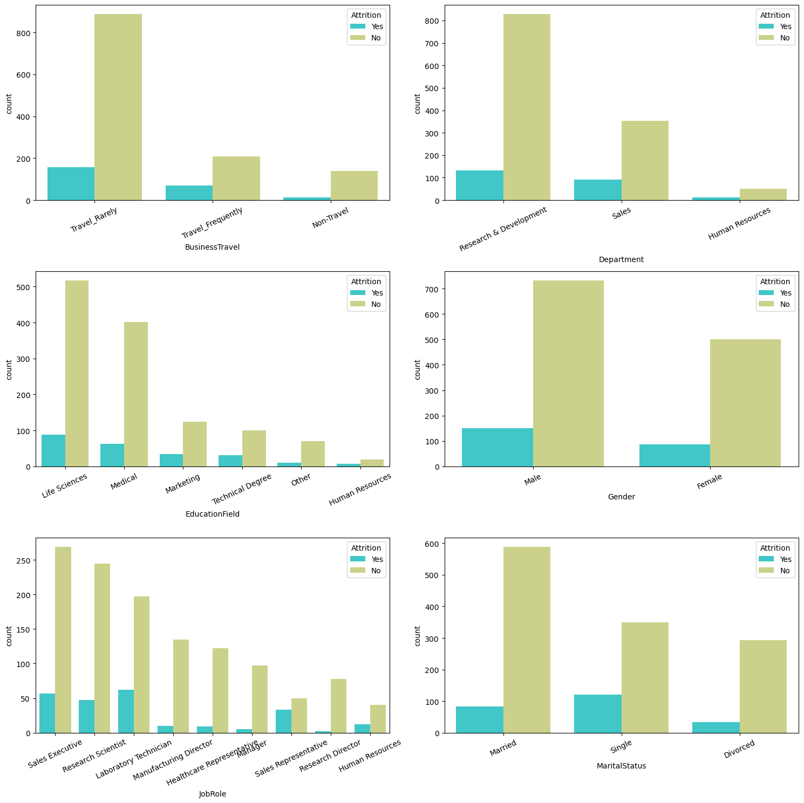
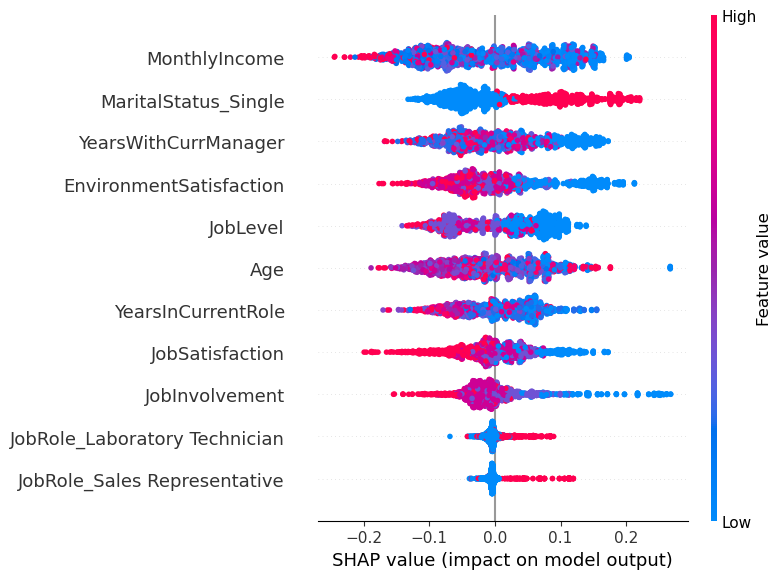

# Background

HR Analytics helps us with interpreting organizational data. It finds the people-related trends in the data and allows the HR Department to take the appropriate steps to keep the organization running smoothly and profitably. Attrition in a corporate setup is one of the complex challenges that the people managers and the HRs personnel have to deal with.

# Problem Formulation
How can HR Analytics be leveraged to identify the key factors that contributing to employee attrition, in order to enable HR departments to implement effective retention strategies and maintain organizational stability and profitability?

# Dataset
The dataset is a compilation of data from 1,470 employees, including variables such as age, education, department, job role, total working years, and more.

# Data Analysis
## A. Univariate Analysis
### 1). Numerical Data

The figure above shows the distribution of data in each column, along with their mean values.

### 2). Categorical Data

The plots show the demographics of the employees in the organization:
1. The attrition rate is quite low, but we still want to understand the key factors that cause it.
2. Most employees travel, but rarely.
3. Research and Development is the department with the highest number of employees.
4. The majority of employees have an educational background in the Life Sciences field.
5. Male employees slightly outnumber female employees.
6. Sales Executive is the most common role.
7. Most employees are married.

## B. Bivariate Analysis
### 1). Numerical Data vs. Attrition

The insighs that can be gained from the visualization are:
1. Attrition mostly occurs among employees in their mid-twenties to mid-thirties.
2. Attrition is more common among employees with a lower daily rate.
2. Attrition is prevalent among amployees with an Environment Satisfaction Score below 2.
3. Attrition mostly happens to employees with a lower job level (below 2). 

These columns are indicated to have a correlation with attrition. Beyond these findings, we cannot draw definitive conclusions. 

For instance, we cannot assert that most attrition happens to employees with lower total years with their current manager, because the data shows that many employees who remain also have lower total years with their current manager. This just reflects the employee demographics within the company.

### 2). Categorical Data vs. Attrition

The insight that can be gained are:
1. Attrition is more common among employees in the Research Scientist role.
2. Attrition mostly happens to employees who are single.

## C. Multivariate Analysis

Interpretation of Correlation with Attrition:
1. **Age and Attrition**: Weak negative correlation (16%)  
Younger employees are slightly more likely to leave the company compared to older employees. 

2. **Job Involvement and Attrition**: Weak negative correlation (13%)  
Employees with lower job involvement tend to leave the company.
3. **Job Level and Attrition**: Weak negative correlation (17%)  
Employees in lower-level jobs are more likely to leave the company than those in higher-level positions.
4. **Monthly Income and Attrition**: Weak negative correlation (16%)  
Employees with lower monthly incomes are more likely to leave the company.
5. **Total Working Years and Attrition**: Weak negative correlation (17%)  
Employees with fewer total working years are more likely to leave the company. 
6. **Years in Current Role and Attrition**: Weak negative correlation (16%)  
Employees with fewer years in their current role are slightly more likely to leave the company.
7. **Years with Current Manager and Attrition**: Weak negative correlation (16%)  
Employees with fewer years under their current manager are slightly more likely to leave the company.
8. **Sales Representative Role and Attrition**: Weak positive correlation (16%)  
Employees in the Sales Representative role are slightly more likely to leave the company.
9. **Single Status and Attrition**: Weak positive correlation (18%)  
Employees who are single are slightly more likely to leave the company.

## D. Predictive Analysis
Predictive analysis was conducted using machine learning algorithms, with the result presented below:

**Logistic Regression**  
 Accuracy: 0.64  
 Precision: 0.66  
 Recall: 0.61  
 F1-Score: 0.63  

**AdaBoost**  
 Accuracy: 0.71  
 Precision: 0.71  
 Recall: 0.71  
 F1-Score: 0.71  

**Random Forest**  
 Accuracy: 0.96  
 Precision: 0.94  
 Recall: 0.98  
 F1-Score: 0.96  

 Among the three algorithms tested, Random Forest achieved the highest accuracy at 96%. Therefore, we will use this algorithm for our data modeling.

 ## E. Feature Importance
 

 Based on the analysis, these are the features that have a significant impact on employee attrition. The interpretations are as follows:
1. Employees with lower monthly income tend to leave the company.
2. Single employees are more likely to leave the company.
3. Employees with lower total years with current manager tend to leave the company.
4. Employees with lower environment satisfaction tend to leave the company.
5. Employees with lower job level tend to leave the company.

# Conclusion
The analysis of employee attrition using HR Analytics reveals several key factors that significantly influence whether employees decide to leave the company. Understanding these factors allows HR departments to develop targeted retention strategies aimed at mitigating attrition. The key findings highlight that employees with lower monthly incomes, those who are single, those with fewer years under their current manager, those with lower satisfaction in their work environment, and those at lower job levels are more prone to leave the organization.

# Recommendations
1. **Increase Compensation:** Consider reviewing and adjusting salary structures to ensure competitive pay, especially for roles identified with higher attrition rates.
2. **Support for Single Employees:** Implement programs or initiatives that support single employees, such as social events, mentorship programs, and work-life balance policies.
3. **Managerial Training and Development:** Invest in training programs for managers to improve their leadership skills and strengthen relationships with their teams. Encouraging longer manager-employee tenures could help reduce turnover.
4. **Enhance Work Environment Satisfaction:** Conduct regular surveys to gauge employee satisfaction with their work environment and implement changes based on feedback. Enhancements could include better facilities, flexible working conditions, and recognition programs.
5. **Career Development Opportunities:** Provide clear career progression paths and professional development opportunities to employees at lower job levels to increase their engagement and commitment to the organization.
